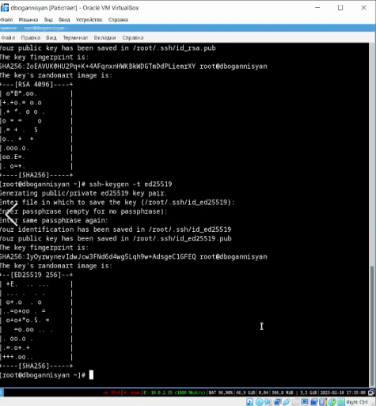

---
## Front matter
title: "Лабораторная работа №3"
subtitle: "Markdown"
author: "Оганнисян Д.Б."

## Generic otions
lang: ru-RU
toc-title: "Содержание"

## Bibliography
bibliography: bib/cite.bib
csl: pandoc/csl/gost-r-7-0-5-2008-numeric.csl

## Pdf output format
toc: true # Table of contents
toc-depth: 2
lof: true # List of figures
lot: true # List of tables
fontsize: 12pt
linestretch: 1.5
papersize: a4
documentclass: scrreprt
## I18n polyglossia
polyglossia-lang:
  name: russian
  options:
	- spelling=modern
	- babelshorthands=true
polyglossia-otherlangs:
  name: english
## I18n babel
babel-lang: russian
babel-otherlangs: english
## Fonts
mainfont: PT Serif
romanfont: PT Serif
sansfont: PT Sans
monofont: PT Mono
mainfontoptions: Ligatures=TeX
romanfontoptions: Ligatures=TeX
sansfontoptions: Ligatures=TeX,Scale=MatchLowercase
monofontoptions: Scale=MatchLowercase,Scale=0.9
## Biblatex
biblatex: true
biblio-style: "gost-numeric"
biblatexoptions:
  - parentracker=true
  - backend=biber
  - hyperref=auto
  - language=auto
  - autolang=other*
  - citestyle=gost-numeric
## Pandoc-crossref LaTeX customization
figureTitle: "Рис."
tableTitle: "Таблица"
listingTitle: "Листинг"
lofTitle: "Список иллюстраций"
lotTitle: "Список таблиц"
lolTitle: "Листинги"
## Misc options
indent: true
header-includes:
  - \usepackage{indentfirst}
  - \usepackage{float} # keep figures where there are in the text
  - \floatplacement{figure}{H} # keep figures where there are in the text
---

# Цель работы

Научиться оформлять отчёты с помощью легковесного языка разметки Markdown.

# Задание

Сделать отчёт по предыдущей лабораторной работе в формате Markdown.

# Теоретическое введение

Markdown — это облегченный язык разметки с синтаксисом форматирования обычного текста. созданный Джоном Грубером и Аароном Шварцем в 2004 году, сегодня это один из самых популярных языков среди программистов. Для записи Markdown можно использовать любой текстовый редактор. Смысл маркдауна в том, что вы делаете разметку своего документа минимальными усилиями, а уже какой-то другой плагин или программа превращает вашу разметку в итоговый документ — например в HTML. Но можно и не в HTML, а в PDF или что-нибудь ещё. [@mark:bash]

# Выполнение лабораторной работы

1.Установка git (рис. @fig:001).

{ #fig:001 width=70%} 

2.Установка gh (рис. @fig:002).

{ #fig:002 width=70% }

3.Базовая настройка git (рис. @fig:003).

{#fig:003 width=70%}

{#fig:004 width=70%}

{#fig:005 width=70%}

{#fig:006 width=70%}

{#fig:007 width=70%}

4.Создайте ключи ssh (рис. @fig:008).

{#fig:008 width=70%}

5.Создайте ключи pgp (рис. @fig:009)

{#fig:009 width=70%}

6.Добавление PGP ключа в GitHub (рис. @fig:010)

{#fig:010 width=70%}

7.Настройка автоматических подписей коммитов git (рис. @fig:011)

{#fig:011 width=70%}

8.Создание репозитория курса на основе шаблона (рис. @fig:012)

{#fig:012 width=70%}

9.Настройка каталога курса (рис. @fig:013)

{#fig:013 width=70%}

{#fig:014 width=70%}

{#fig:015 width=70%}

{#fig:016 width=70%}

# Выводы

В процессе выполнения этой лабораторной работы я научился работать с языком разметки Markdown. Познакомился с базовым синтаксисом Mardown.

# Список литературы{.unnumbered}

::: {#refs}
:::
