---
## Front matter
lang: ru-RU
title: Презентация №5
subtitle: Анализ файловой системы Linux. Команды для работы с файлами и каталогами
author:
  - Оганнисян Давит Багратович
institute:
  - Российский университет дружбы народов, Москва, Россия
  - Объединённый институт ядерных исследований, Дубна, Россия
date: 07 марта 2023

## i18n babel
babel-lang: russian
babel-otherlangs: english

## Formatting pdf
toc: false
toc-title: Содержание
slide_level: 2
aspectratio: 169
section-titles: true
theme: metropolis
header-includes:
 - \metroset{progressbar=frametitle,sectionpage=progressbar,numbering=fraction}
 - '\makeatletter'
 - '\beamer@ignorenonframefalse'
 - '\makeatother'
---

## Цели и задачи

- Ознакомление с файловой системой Linux, её структурой, именами и содержанием каталогов. Приобретение практических навыков по применению команд для работы с файлами и каталогами, по управлению процессами (и работами), по проверке использования диска и обслуживанию файловой системы.

## Выполнение лабораторной работы

## Выполните все примеры, приведённые в первой части описания лабораторной работы.

## Примеры с cp

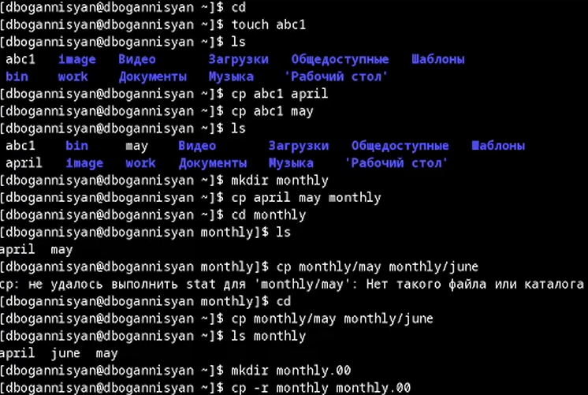

## Примеры с mv

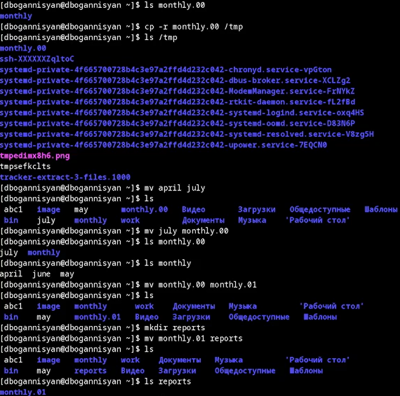

## Примеры с  chmod

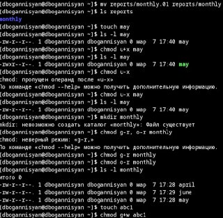

## Выполните следующие действия, зафиксировав в отчёте по лабораторной работе используемые при этом команды и результаты их выполнения:

## Скопируйте файл /usr/include/sys/io.h в домашний каталог и назовите его equipment. Если файла io.h нет, то используйте любой другой файл в каталоге /usr/include/sys/ вместо него.

## В домашнем каталоге создайте директорию ~/ski.plases.

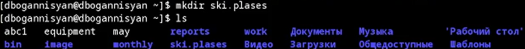

## Переместите файл equipment в каталог ~/ski.plases.

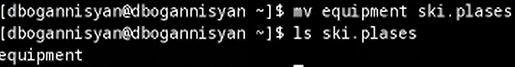

## Переименуйте файл ~/ski.plases/equipment в ~/ski.plases/equiplist.

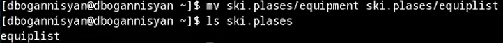

## Создайте в домашнем каталоге файл abc1 и скопируйте его в каталог ~/ski.plases, назовите его equiplist2.

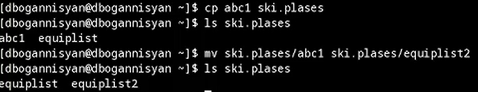

## Создайте каталог с именем equipment в каталоге ~/ski.plases.

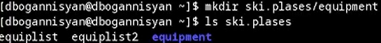

## Переместите файлы ~/ski.plases/equiplist и equiplist2 в каталог ~/ski.plases/equipment.

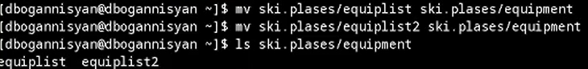

## Создайте и переместите каталог ~/newdir в каталог ~/ski.plases и назовите его plans.

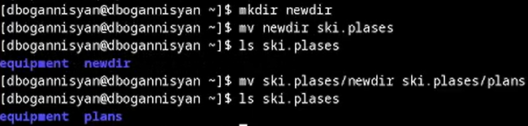

## Определите опции команды chmod, считая, что в начале таких прав нет:

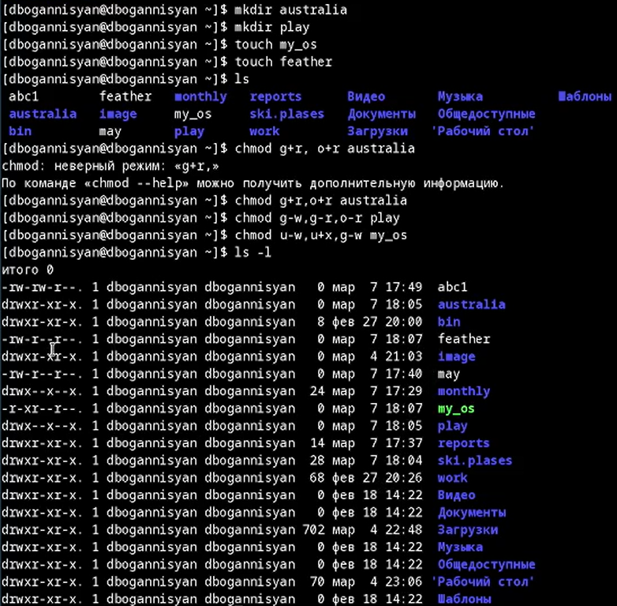

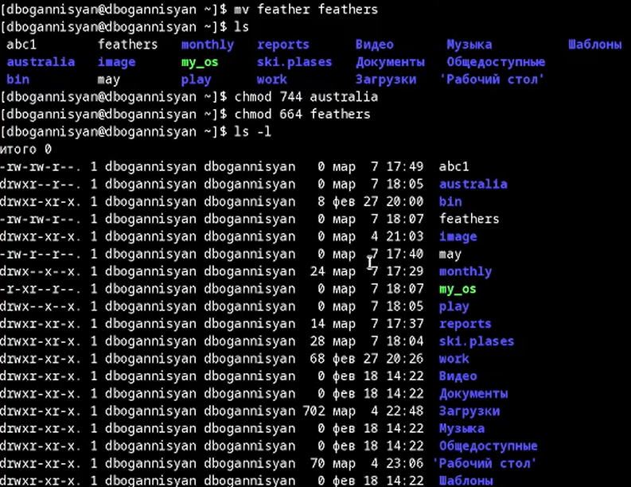

## Проделайте приведённые ниже упражнения, записывая в отчёт по лабораторной работе используемые при этом команды:

## Просмотрите содержимое файла /etc/password.

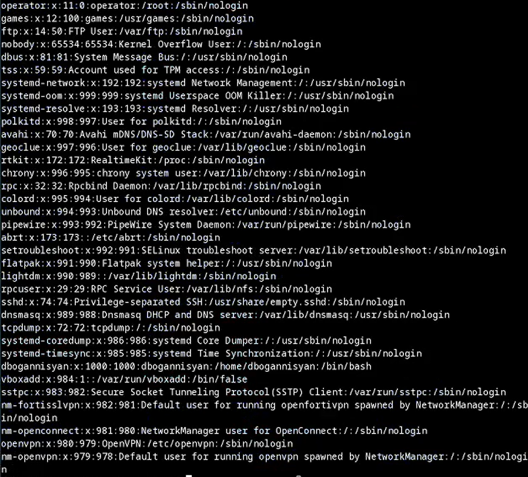

## Скопируйте файл ~/feathers в файл ~/file.old.

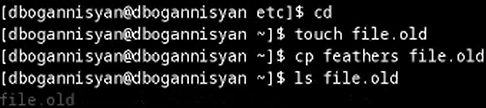

## Переместите файл ~/file.old в каталог ~/play.

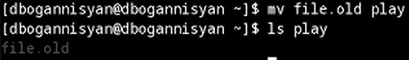

## Скопируйте каталог ~/play в каталог ~/fun.

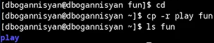

## Переместите каталог ~/fun в каталог ~/play и назовите его games.

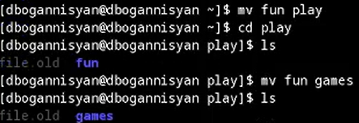

## Лишите владельца файла ~/feathers права на чтение.

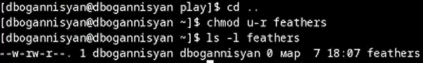

## Что произойдёт, если вы попытаетесь просмотреть файл ~/feathers командой cat?

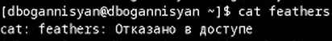

## Что произойдёт, если вы попытаетесь скопировать файл ~/feathers?

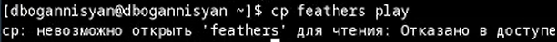

## Дайте владельцу файла ~/feathers право на чтение.

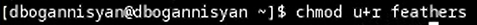

## Лишите владельца каталога ~/play права на выполнение.

## Перейдите в каталог ~/play. Что произошло?

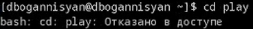

## Дайте владельцу каталога ~/play право на выполнение.

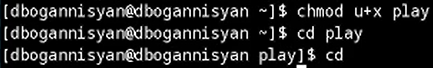

## Прочитайте man по командам mount, fsck, mkfs, kill и кратко их охарактеризуйте, приведя примеры.

## mount

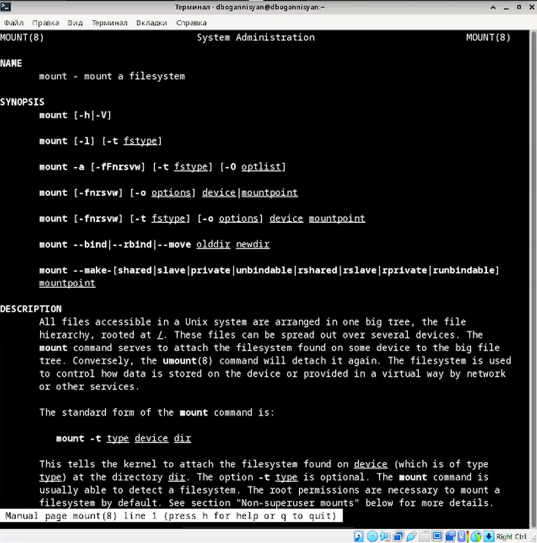

## fsck

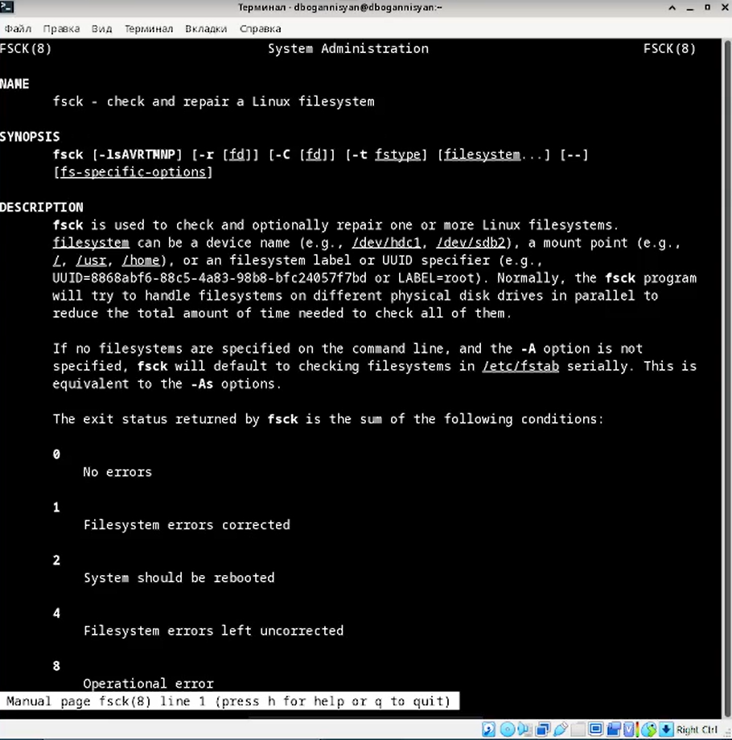

## mkfs

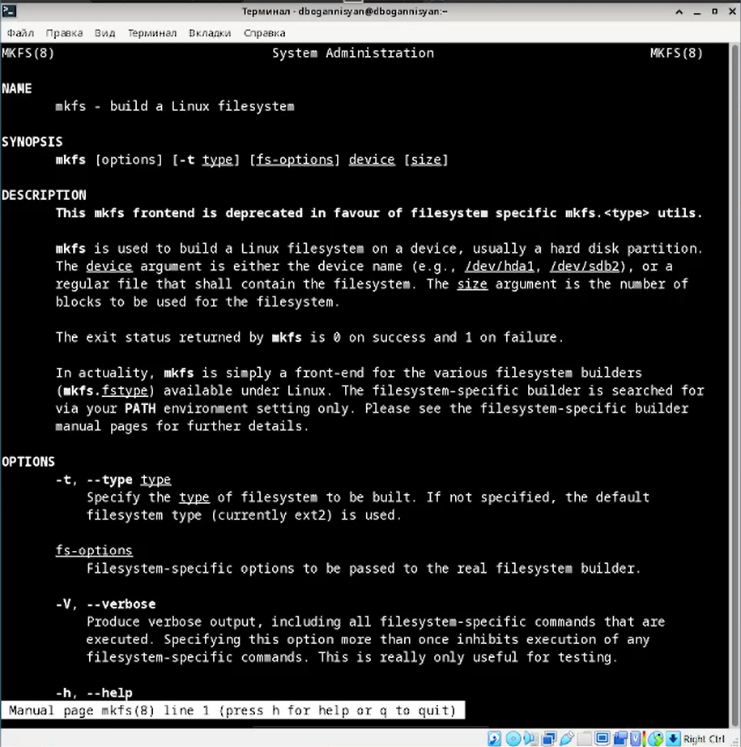

## kill

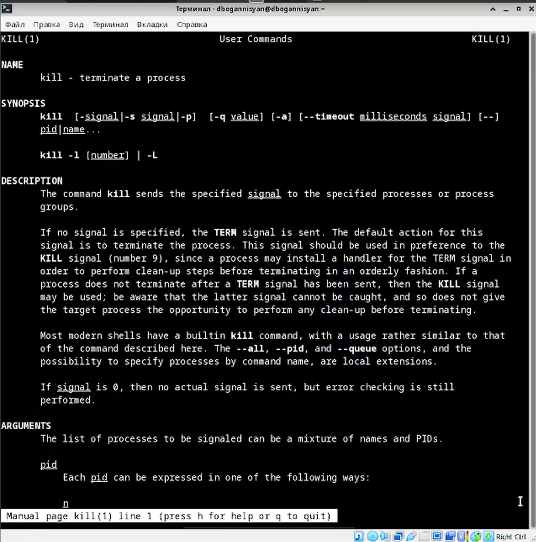

## Вывод

Ознакомился с файловой системой Linux, её структурой, именами и содержанием каталогов. Приобрел практические навыкы по применению команд для работы с файлами и каталогами, по управлению процессами (и работами), по проверке исполь зования диска и обслуживанию файловой системы.
