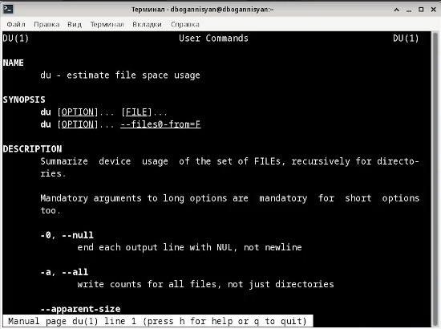

---
## Front matter
lang: ru-RU
title: Презентация №6
subtitle: Поиск файлов. Перенаправление ввода-вывода. Просмотр запущенных процессов
author:
  - Оганнисян Давит Багратович
institute:
  - Российский университет дружбы народов, Москва, Россия
date: 13 марта 2023

## i18n babel
babel-lang: russian
babel-otherlangs: english

## Formatting pdf
toc: false
toc-title: Содержание
slide_level: 2
aspectratio: 169
section-titles: true
theme: metropolis
header-includes:
 - \metroset{progressbar=frametitle,sectionpage=progressbar,numbering=fraction}
 - '\makeatletter'
 - '\beamer@ignorenonframefalse'
 - '\makeatother'
---

## Цели и задачи

- Ознакомление с инструментами поиска файлов и фильтрации текстовых данных.
Приобретение практических навыков: по управлению процессами (и заданиями), по
проверке использования диска и обслуживанию файловых систем.

## Выполнение лабораторной работы

## Запишите в файл file.txt названия файлов, содержащихся в каталоге /etc. Допишите в этот же файл названия файлов, содержащихся в вашем домашнем каталоге

## Выведите имена всех файлов из file.txt, имеющих расширение .conf, после чего запишите их в новый текстовой файл conf.txt.

## Определите, какие файлы в вашем домашнем каталоге имеют имена, начинавшиеся с символа c? Предложите несколько вариантов, как это сделать.

## Выведите на экран (по странично) имена файлов из каталога /etc, начинающиеся с символа h.

## Запустите в фоновом режиме процесс, который будет записывать в файл ~/logfile файлы, имена которых начинаются с log.

## Удалите файл ~/logfile.

## Запустите из консоли в фоновом режиме редактор gedit.

## Определите идентификатор процесса gedit, используя команду ps, конвейер и фильтр grep. Как ещё можно определить идентификатор процесса?

## Прочтите справку (man) команды kill, после чего используйте её для завершения процесса gedit.

{#fig:010 width=70%}

## Команда

{#fig:011 width=70%}

## Выполните команды df и du, предварительно получив более подробную информацию об этих командах, с помощью команды man. 

{#fig:012 width=70%}

## man du

{#fig:013 width=70%}

## команда df 

{#fig:014 width=70%}

## команда du 

{#fig:015 width=70%}

## Воспользовавшись справкой команды find, выведите имена всех директорий, имеющихся в вашем домашнем каталоге

{#fig:016 width=70%}

## команда find

{#fig:017 width=70%}

## Вывод

Я ознакомился с инструментами поиска файлов и фильтрации текстовых данных.
приобрел практические навыкы: по управлению процессами (и заданиями), по
проверке использования диска и обслуживанию файловых систем.
:::

