---
## Front matter
lang: ru-RU
title: Презентация №7
subtitle: Командная оболочка Midnight Commander
author:
  - Оганнисян Давит Багратович
institute:
  - Российский университет дружбы народов, Москва, Россия
date: 24 марта 2023

## i18n babel
babel-lang: russian
babel-otherlangs: english

## Formatting pdf
toc: false
toc-title: Содержание
slide_level: 2
aspectratio: 169
section-titles: true
theme: metropolis
header-includes:
 - \metroset{progressbar=frametitle,sectionpage=progressbar,numbering=fraction}
 - '\makeatletter'
 - '\beamer@ignorenonframefalse'
 - '\makeatother'
---

## Цели и задачи

- Освоение основных возможностей командной оболочки Midnight Commander. Приобретение навыков практической работы по просмотру каталогов и файлов; манипуляций
с ними.

## Выполнение лабораторной работы

## Изучите информацию о mc, вызвав в командной строке man mc.

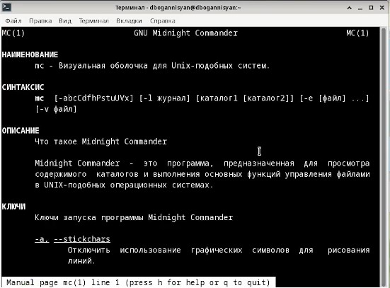

## Запустите из командной строки mc, изучите его структуру и меню.

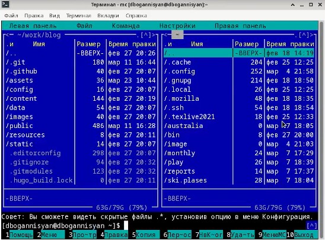

## Выполните несколько операций в mc, используя управляющие клавиши (операции с панелями; выделение/отмена выделения файлов, копирование/перемещение файлов, получение информации о размере и правах доступа на файлы и/или каталоги и т.п.)

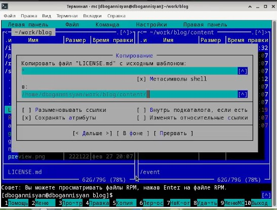

## Операция 2

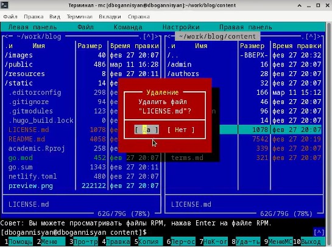

## Операция 3

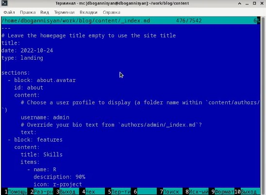

## Выполните основные команды меню левой (или правой) панели. Оцените степень подробности вывода информации о файлах.

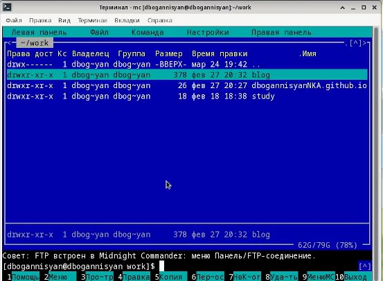

## Используя возможности подменю Файл , выполните:
## просмотр содержимого текстового файла

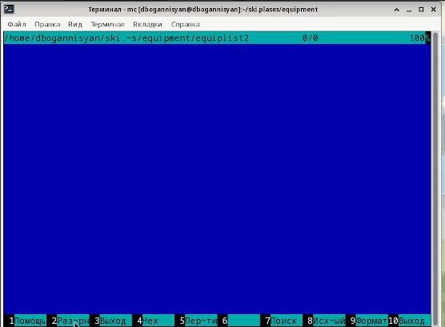

## редактирование содержимого текстового файла (без сохранения результатов редактирования);

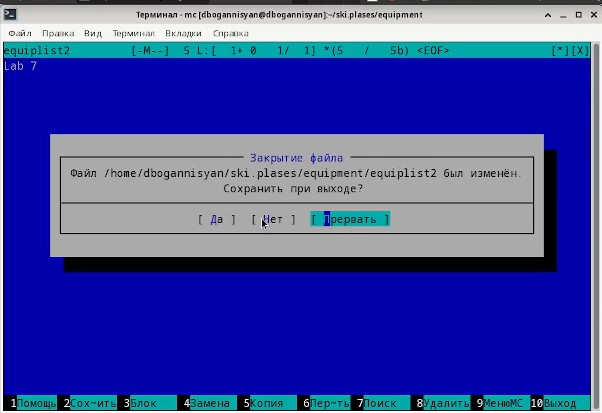

## создание каталога;

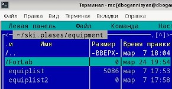

## копирование в файлов в созданный каталог.

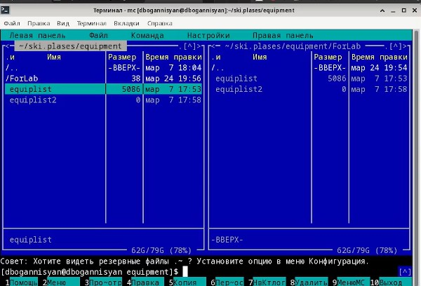

## С помощью соответствующих средств подменю Команда осуществите:
## поиск в файловой системе файла с заданными условиями (например, файла с расширением .c или .cpp, содержащего строку main);

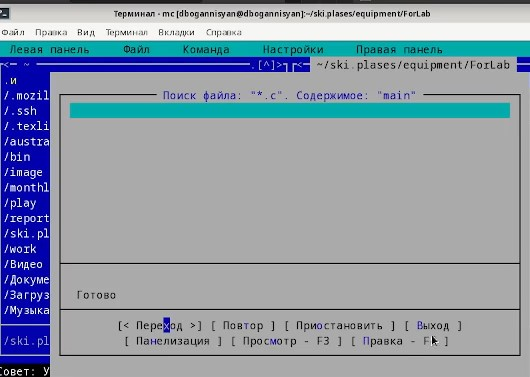

## .cpp

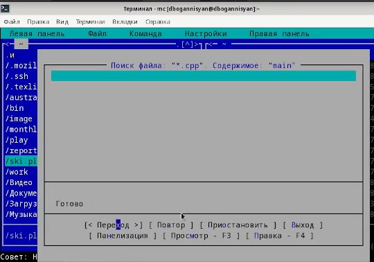

## выбор и повторение одной из предыдущих команд;

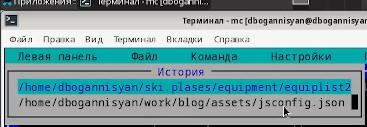

## переход в домашний каталог;

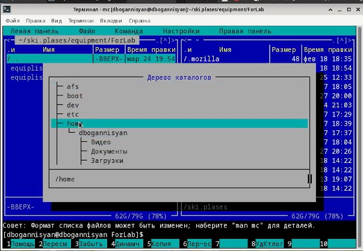

## анализ файла меню и файла расширений.

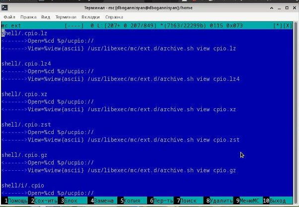

## menu

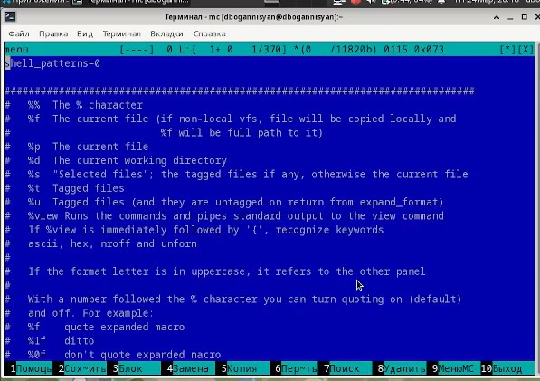

## Вызовите подменю Настройки . Освойте операции, определяющие структуру экрана mc (Full screen, Double Width, Show Hidden Files и т.д.)

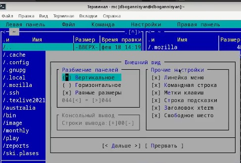

## 2nd

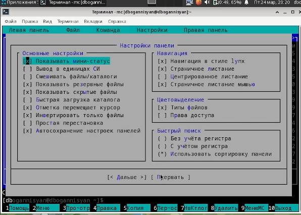

## 3rd

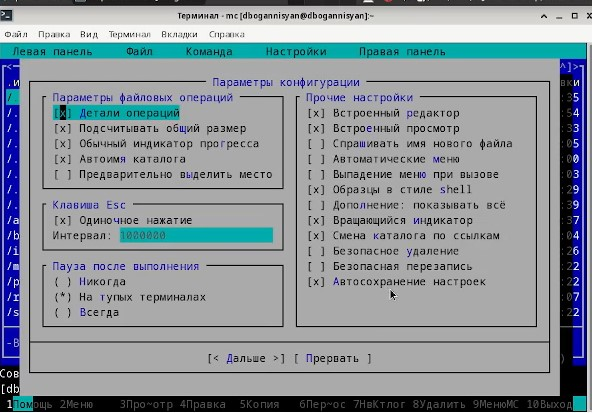

# Выводы

Я освоенил основные возможности командной оболочки Midnight Commander. Приобрел навыки практической работы по просмотру каталогов и файлов; манипуляций
с ними.
