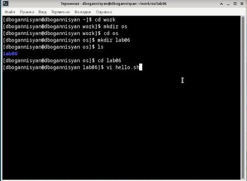
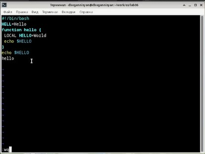
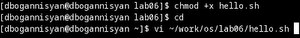
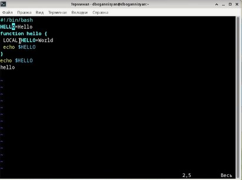
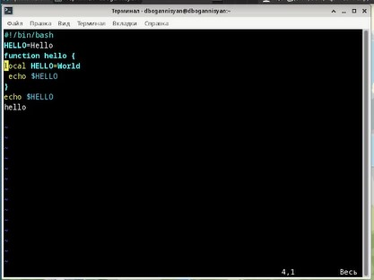
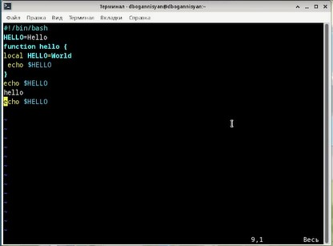
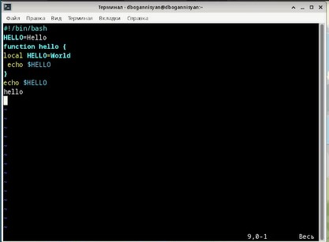
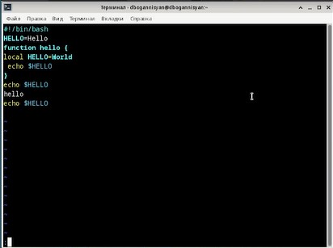
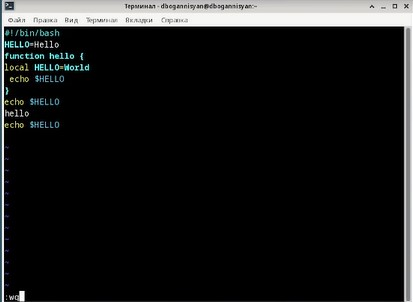

---
## Front matter
lang: ru-RU
title: Презентация №8
subtitle: Текстовый редактор vi
author:
  - Оганнисян Давит Багратович
institute:
  - Российский университет дружбы народов, Москва, Россия
date: 01 апреля 2023

## i18n babel
babel-lang: russian
babel-otherlangs: english

## Formatting pdf
toc: false
toc-title: Содержание
slide_level: 2
aspectratio: 169
section-titles: true
theme: metropolis
header-includes:
 - \metroset{progressbar=frametitle,sectionpage=progressbar,numbering=fraction}
 - '\makeatletter'
 - '\beamer@ignorenonframefalse'
 - '\makeatother'
---

## Цели и задачи

- Познакомиться с операционной системой Linux. Получить практические навыки работы с редактором vi, установленным по умолчанию практически во всех дистрибутивах.

## Выполнение лабораторной работы

## Создайте каталог с именем ~/work/os/lab06. Перейдите во вновь созданный каталог. Вызовите vi и создайте файл hello.sh

## Нажмите клавишу i и вводите следующий текст. Нажмите клавишу Esc для перехода в командный режим после завершения ввода текста. Нажмите : для перехода в режим последней строки и внизу вашего экрана появится приглашение в виде двоеточия. Нажмите w (записать) и q (выйти), а затем нажмите клавишу Enter для сохранения вашего текста и завершения работы.

## Сделайте файл исполняемым. Вызовите vi на редактирование файла

## Установите курсор в конец слова HELL второй строки. Перейдите в режим вставки и замените на HELLO. Нажмите Esc для возврата в командный режим.

## Установите курсор на четвертую строку и сотрите слово LOCAL. Перейдите в режим вставки и наберите следующий текст: local, нажмите Esc для возврата в командный режим.

## Установите курсор на последней строке файла. Вставьте после неё строку, содержащую следующий текст: echo $HELLO. Нажмите Esc для перехода в командный режим.

## Удалите последнюю строку.

## Введите команду отмены изменений u для отмены последней команды

## Введите символ : для перехода в режим последней строки. Запишите произведённые изменения и выйдите из vi.

# Выводы

Я познакомился с операционной системой Linux. Получил практические навыки работы с редактором vi, установленным по умолчанию практически во всех дистрибутивах.
