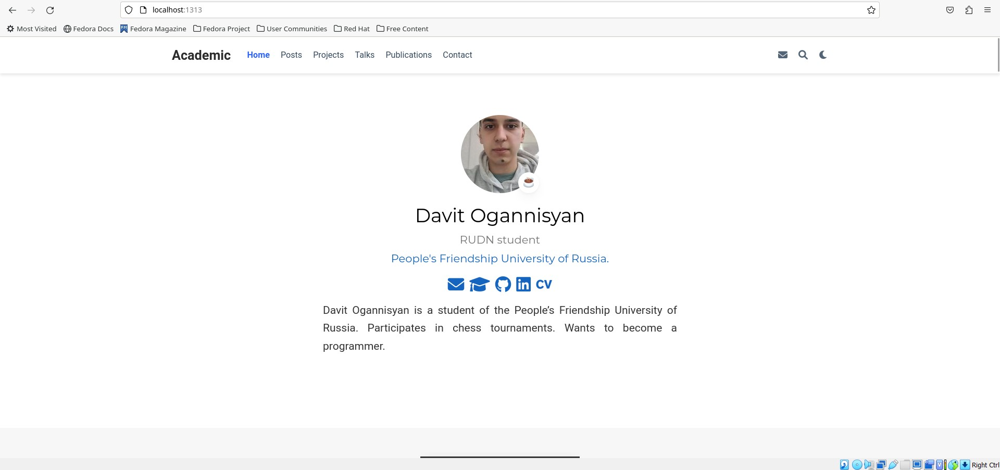
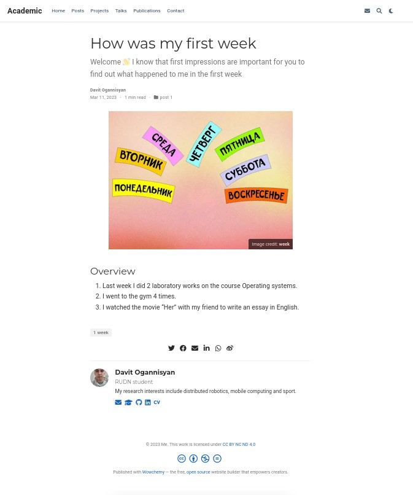
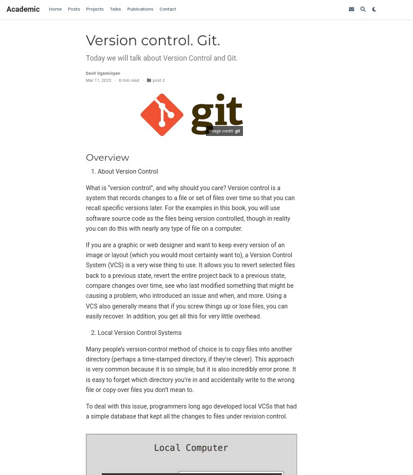

---
## Front matter
lang: ru-RU
title: Презентация второго этапа индивидуального проекта
subtitle: Добавить к сайту данные о себе
author:
  - Оганнисян Давит Багратович
institute:
  - Российский университет дружбы народов, Москва, Россия
date: 11 марта 2023

## i18n babel
babel-lang: russian
babel-otherlangs: english

## Formatting pdf
toc: false
toc-title: Содержание
slide_level: 2
aspectratio: 169
section-titles: true
theme: metropolis
header-includes:
 - \metroset{progressbar=frametitle,sectionpage=progressbar,numbering=fraction}
 - '\makeatletter'
 - '\beamer@ignorenonframefalse'
 - '\makeatother'
---

## Цели и задачи

- Продолжить работу со своим сайтом.
- Редактировать его в соответствие с требованиями.
- Добавить данные о себе на сайт.

## Выполнение работы

## Разместить фотографию владельца сайта. Разместить краткое описание владельца сайта (Biography). Добавить информацию об интересах (Interests). Добавить информацию от образовании (Education).

{#fig:001 width=70%}

## Сделать пост по прошедшей неделе.

{#fig:002 width=70%}

## Добавим пост на тему по выбору. Я выбрал тему: Управление версиями. Git.

{#fig:003 width=70%}

## Вывод

В процессе выполнения второго этапа индивидуального проекта я научился редактировать данные о себе, а также писать посты и добавлять их на сайт.
