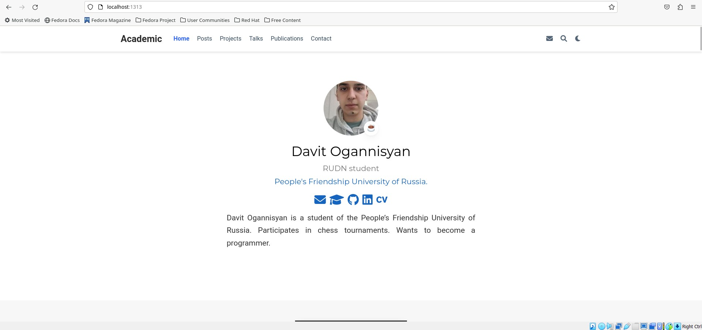
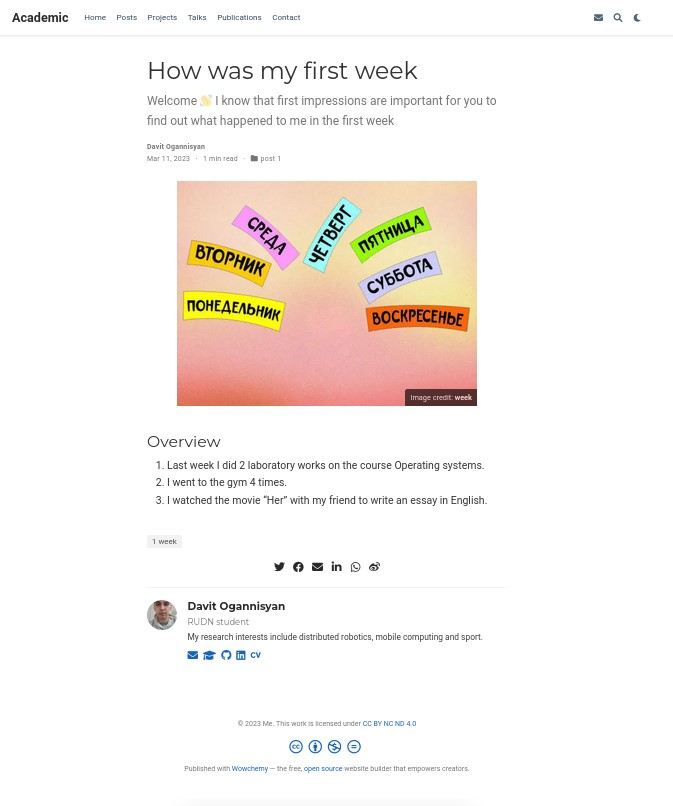
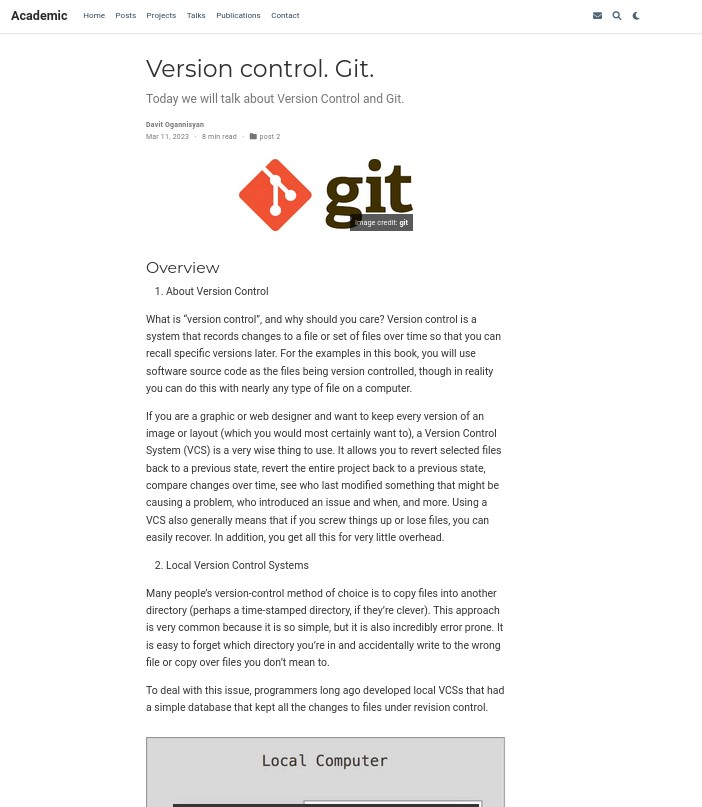

---
## Front matter
title: "Второй этап индивидуального проекта"
subtitle: "Добавить к сайту данные о себе"
author: "Давит Багратович Оганнисян"

## Generic otions
lang: ru-RU
toc-title: "Содержание"

## Bibliography
bibliography: bib/cite.bib
csl: pandoc/csl/gost-r-7-0-5-2008-numeric.csl

## Pdf output format
toc: true # Table of contents
toc-depth: 2
lof: true # List of figures
lot: true # List of tables
fontsize: 12pt
linestretch: 1.5
papersize: a4
documentclass: scrreprt
## I18n polyglossia
polyglossia-lang:
  name: russian
  options:
	- spelling=modern
	- babelshorthands=true
polyglossia-otherlangs:
  name: english
## I18n babel
babel-lang: russian
babel-otherlangs: english
## Fonts
mainfont: PT Serif
romanfont: PT Serif
sansfont: PT Sans
monofont: PT Mono
mainfontoptions: Ligatures=TeX
romanfontoptions: Ligatures=TeX
sansfontoptions: Ligatures=TeX,Scale=MatchLowercase
monofontoptions: Scale=MatchLowercase,Scale=0.9
## Biblatex
biblatex: true
biblio-style: "gost-numeric"
biblatexoptions:
  - parentracker=true
  - backend=biber
  - hyperref=auto
  - language=auto
  - autolang=other*
  - citestyle=gost-numeric
## Pandoc-crossref LaTeX customization
figureTitle: "Рис."
listingTitle: "Листинг"
lofTitle: "Список иллюстраций"
lotTitle: "Список таблиц"
lolTitle: "Листинги"
## Misc options
indent: true
header-includes:
  - \usepackage{indentfirst}
  - \usepackage{float} # keep figures where there are in the text
  - \floatplacement{figure}{H} # keep figures where there are in the text
---

# Цель работы

Продолжить работу со своим сайтом. Редактировать его в соответствие с требованиями. Добавить данные о себе на сайт.

# Задание

 1. Разместить фотографию владельца сайта.
 2. Разместить краткое описание владельца сайта (Biography).
 3. Добавить информацию об интересах (Interests).
 4. Добавить информацию от образовании (Education).
 5. Сделать пост по прошедшей неделе.
 6. Добавить пост на тему по выбору: Управление версиями. Git. или Непрерывная интеграция и непрерывное развертывание (CI/CD).

# Теоретическое введение

Сайт - это совокупность веб-страниц, объединенных под общим доменом и связанных ссылками, тематикой и дизайнерским оформлением. Мы будем создавать статический сайт, для этого нам понадобится Hugo - генератор статических страниц для интернета. Мы продолжаем работу с Hugo. Будем учиться редактировать данные о себе и писать посты.

# Выполнение лабораторной работы

1. Разместить фотографию владельца сайта.
2. Разместить краткое описание владельца сайта (Biography).
3. Добавить информацию об интересах (Interests).
4. Добавить информацию от образовании (Education).

{#fig:001 width=70%}

5. Сделать пост по прошедшей неделе.

{#fig:002 width=70%}

6. Добавим пост на тему по выбору. Я выбрал тему: Управление версиями. Git.

{#fig:003 width=70%}

# Выводы

В процессе выполнения второго этапа индивидуального проекта я научился редактировать данные о себе, а также писать посты и добавлять их на сайт.

